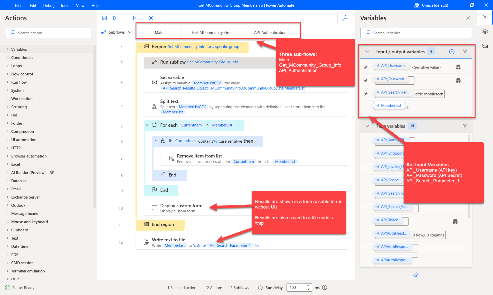
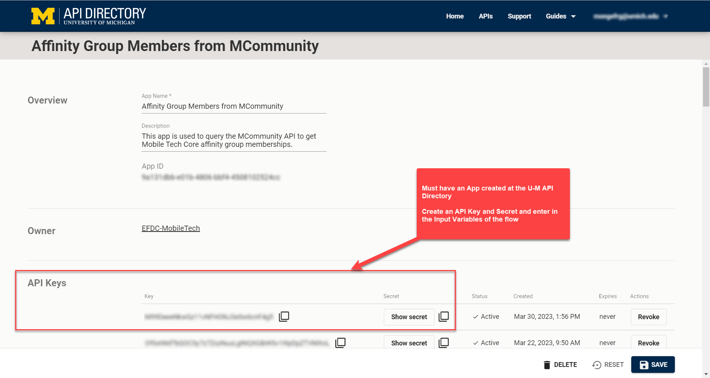
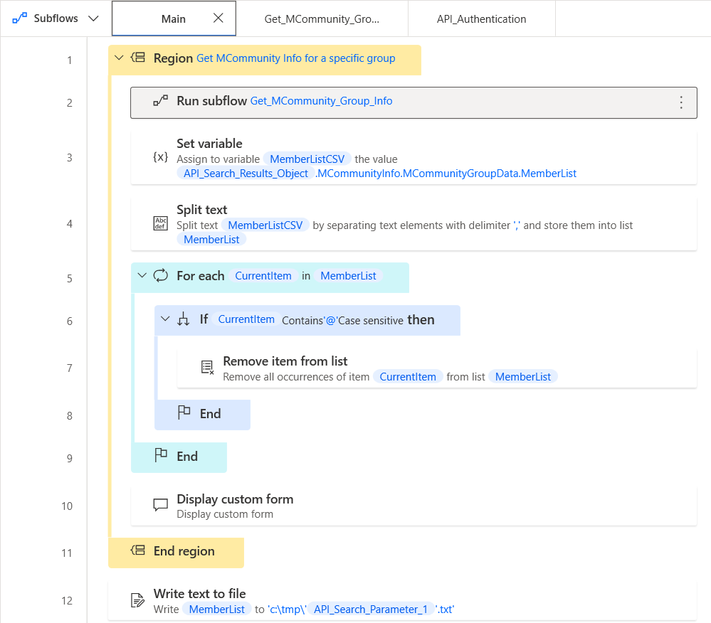
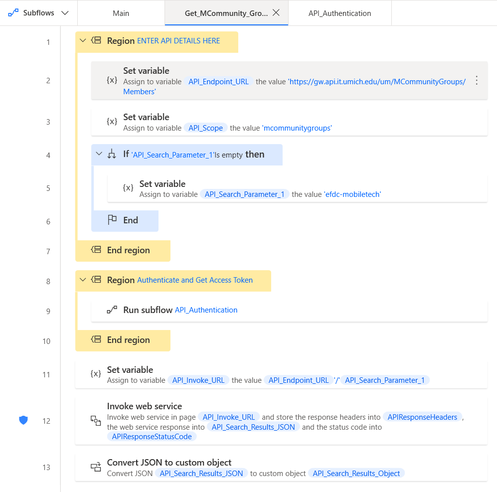
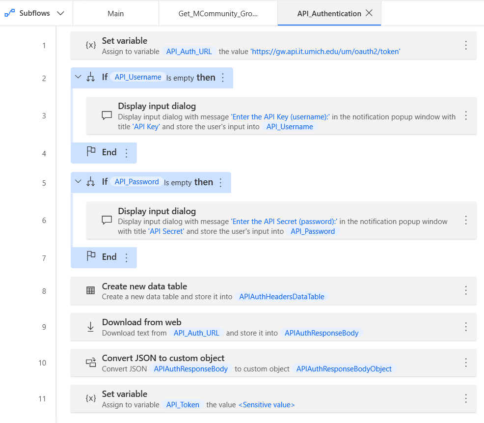

# Get MCommunity Group Membership

## Description
This Power Automate Desktop flow shows how to connect to the University of Michigan API Directory (Apigee), how to authentication using OAuth2 Client Credentials, and how to retrieve a list of members from a group using the MCommunityGroups API.

## Quick Start Guide
+ Get an API key for MCommunityGroups from the U-M API Directory (https://dir.api.it.umich.edu/)
+ Create a new desktop flow with three sub-flows: Main, Get_MCommunity_Group_Info, and API_Authentication
+ Copy & paste the flow contents from the /src directory into each sub-flow
+ Create 4 input variables: API_Username (text, sensitive), API_Password (text, sensitive), API_Search_Parameter_1 (text), and MemberList (list)
+ Enter your API secret and key from API Directory into the API_Username and API_Password variables
+ Enter your MCommunity group name (without @umich.edu) in the API_Search_Parameter_1 variable
+ Run the flow
+ Get a copy of your results from c:\tmp\<mcommunity group name>.txt

## Documentation
### Overall flow

### Get an API key
+ Get an API Key for MCommunityGroups from the U-M API Directory (https://dir.api.it.umich.edu/)
+ Ensure OAuthTokenProvider and MCommunityGroups APIs are enabled for your app

### Create and customize desktop flows
+ Open the PowerAutomate Desktop app and login to the UMich environment. As of this writing, the Michigan Medicine environment has some restrictions that may not allow you to connect to APIs.
+ Create a new desktop flow with three sub-flows: Main, Get_MCommunity_Group_Info, and API_Authentication
+ Copy & paste the flow contents from the /src directory into each sub-flow
+ 
+ 
+ 
+ Create 4 input variables: API_Username (text, sensitive), API_Password (text, sensitive), API_Search_Parameter_1 (text), and MemberList (list)
+ To display the output in a form, keep the "Display Custom form" step under Main enabled. To hide it, disable the step.
+ If needed, change the path to the file in which to save the group members in the "Write to file" step under Main
+ Alternatively, create a separate step to save the data to a SharePoint List, database table, etc. Keep in mind that you are working inside the UMich environment, so databases behind Michigan Medicine's firewall may not be directly accessible.

### Setup input variables
+ Enter your API secret and key from API Directory into the API_Username and API_Password variables
+ Enter your MCommunity group name (without @umich.edu) in the API_Search_Parameter_1 variable

### Run flow and get output
+ Run the flow
+ Get a copy of your results from c:\tmp\<mcommunity group name>.txt (or from the path set in the "Write to file" step)

## Additional Resources
+ University of Michigan API Directory - https://dir.api.it.umich.edu/
+ MCommunityGroups API documentation - https://dir.api.it.umich.edu/docs/mcommunitygroups/1/overview

## About the Team
The Mobile Technologies Core provides investigators across the University of Michigan the support and guidance needed to utilize mobile technologies and digital mental health measures in their studies. Experienced faculty and staff offer hands-on consultative services to researchers throughout the University – regardless of specialty or research focus.

## Contact
To get in touch, contact the individual developers in the check-in history.

If you need assistance identifying a contact person, email the EFDC's Mobile Technologies Core at: efdc-mobiletech@umich.edu.

## Credits
#### Contributors:
+ Eisenberg Family Depression Center [(@DepressionCenter)](https://github.com/DepressionCenter/)
+ Gabriel Mongefranco [(@gabrielmongefranco)](https://github.com/gabrielmongefranco)

#### This work is based in part on the following projects, libraries and/or studies:
+ None

## License
### Copyright Notice
Copyright © 2023 The Regents of the University of Michigan

### Software and Library License
This program is free software: you can redistribute it and/or modify it under the terms of the GNU General Public License as published by the Free Software Foundation, either version 3 of the License, or (at your option) any later version.

This program is distributed in the hope that it will be useful, but WITHOUT ANY WARRANTY; without even the implied warranty of MERCHANTABILITY or FITNESS FOR A PARTICULAR PURPOSE. See the GNU General Public License for more details.

You should have received a copy of the GNU General Public License along with this program. If not, see <https://www.gnu.org/licenses/gpl-3.0-standalone.html>.

### Documentation License
Permission is granted to copy, distribute and/or modify this document 
under the terms of the GNU Free Documentation License, Version 1.3 
or any later version published by the Free Software Foundation; 
with no Invariant Sections, no Front-Cover Texts, and no Back-Cover Texts. 
You should have received a copy of the license included in the section entitled "GNU 
Free Documentation License". If not, see <https://www.gnu.org/licenses/fdl-1.3-standalone.html>

## Citation
If you find this repository, code or paper useful for your research, please cite it.

----

Copyright © 2023 The Regents of the University of Michigan
